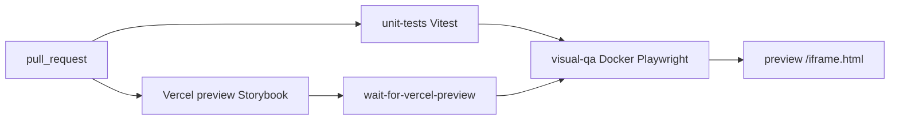

# Testing pyramid, Storybook Vercel, preview visual QA

**Goal:** Every PR: Vitest (jsdom/Node) in seconds, then Dockerized Playwright screenshots + axe against the live Vercel Storybook preview.

**Locked choices:** ship slice C; Playwright `toHaveScreenshot` + `@axe-core/playwright`; no Chromatic; no `@storybook/test-runner` / Jest.

## Current baseline

- Bottom two pyramid tiers already exist: 34 Vitest files, root [`vitest.config.ts`](vitest.config.ts), no workspace file.
- Storybook 9.1 Vite at [`apps/storybook`](apps/storybook). No Playwright, no `vercel.json`, no `.github/`.
- Tokens have no `BREAKPOINTS`. No component uses `@container` (skip a live container-query story; keep the pattern in comments).
- Theme loads Inter via `@fontsource` in [`packages/theme-default/src/tokens.css`](packages/theme-default/src/tokens.css) — `document.fonts.ready` is mandatory.
- Vercel account is hobby (no teams). GitHub repo is [proteus-ui/proteus](https://github.com/proteus-ui/proteus).

## Spec deviations (intentional)

- **Runner:** Playwright project that reads Storybook `index.json` and opens `iframe.html?id=…&viewMode=story`. Same flake rules as §5 (clock, animation CSS, scrollbars, fonts, images, 1% threshold).
- **Viewports:** Storybook 9 `index.json` has tags, not CSF `parameters`. Use tags `viewport-sm` | `viewport-md` | `viewport-lg` | `viewport-xl`. No tag → one shot at `BREAKPOINTS.lg`.
- **Playwright image:** pin `@playwright/test` and `mcr.microsoft.com/playwright:v<same>-jammy` together. Do not use spec’s `v1.41.0`.
- **Docker install:** do not volume-mount host `node_modules` (Darwin vs Linux). Container always `pnpm install` then test.
- **CI trigger:** keep spec’s same-workflow shape (`visual-qa` `needs: unit-tests`, then `patrickedqvist/wait-for-vercel-preview@v1.3.3`) so a unit failure never starts Docker. Pin 1.3.3 not 1.3.0.
- **LFS globs:** Playwright writes `*-snapshots/*.png`, not only `__snapshots__/`.

## Architecture



- **Tier 1:** Vitest workspaces — `packages/core` (jsdom), `packages/tokens` + `packages/theme-default` (Node). `apps/*` omitted until an app has unit tests.
- **Tier 2:** unchanged RTL/ARIA tests. No double-testing appearance in jsdom.
- **Tier 3:** Playwright vs Vercel preview (CI) or vs `storybook-static` only for local smoke; **baselines always produced inside Docker**.

## File map

- Create [`vitest.workspace.ts`](vitest.workspace.ts) — `defineWorkspace(["packages/*"])`.
- Modify [`vitest.config.ts`](vitest.config.ts) — shared defaults + coverage from spec; keep `environmentMatchGlobs` for [`packages/core/src/build.test.ts`](packages/core/src/build.test.ts).
- Create `packages/tokens/vitest.config.ts` and `packages/theme-default/vitest.config.ts` with `environment: "node"`. Core keeps jsdom via root/workspace default.
- Modify [`packages/tokens/src/index.ts`](packages/tokens/src/index.ts) — export `BREAKPOINTS` exactly as §6A.
- Modify [`packages/tokens/src/index.test.ts`](packages/tokens/src/index.test.ts) — assert keys and widths.
- Create [`apps/storybook/playwright.config.ts`](apps/storybook/playwright.config.ts) — `baseURL` from `PLAYWRIGHT_BASE_URL`, Chromium only, snapshot path under `apps/storybook/tests/visual`.
- Create [`apps/storybook/tests/visual/stories.spec.ts`](apps/storybook/tests/visual/stories.spec.ts) — index crawl, skip `type !== "story"` and tag `skip-visual`, inject flake CSS, freeze clock to `2026-01-01T12:00:00Z`, fonts/images, axe on `#storybook-root`, screenshot loop.
- Create [`apps/storybook/.storybook/visual-test-overrides.css`](apps/storybook/.storybook/visual-test-overrides.css) — §5A CSS (also injected by Playwright so CI-vs-preview does not depend on Storybook loading it).
- Modify [`apps/storybook/src/PageFrame.stories.tsx`](apps/storybook/src/PageFrame.stories.tsx) — tags `viewport-sm`, `viewport-md`, `viewport-lg` on `Default` only.
- Modify [`apps/storybook/package.json`](apps/storybook/package.json) — `@playwright/test`, `@axe-core/playwright`, `@proteus-ui/tokens` already present.
- Modify root [`package.json`](package.json) — `packageManager` (pnpm from lockfile), scripts below. Keep `test` as Vitest alias.
- Create [`vercel.json`](vercel.json) — `buildCommand`: `pnpm --filter @proteus-ui/storybook build-storybook`; `outputDirectory`: `apps/storybook/storybook-static`; `framework`: `null`; `installCommand`: `pnpm install --frozen-lockfile`.
- Create [`.gitattributes`](.gitattributes) — LFS for `**/__snapshots__/**/*.png` and `**/*-snapshots/**/*.png`.
- Create [`.github/workflows/ci.yml`](.github/workflows/ci.yml) and [`.github/workflows/update-snapshots.yml`](.github/workflows/update-snapshots.yml) (ChatOps `/update-snapshots` as §9).
- No custom `Dockerfile.test` — stock Playwright image + in-container `pnpm install`.

## Scripts (root)

```json
{
  "test": "vitest run",
  "test:unit": "vitest run",
  "test:unit:watch": "vitest",
  "test:coverage": "vitest run --coverage",
  "dev:storybook": "pnpm --filter @proteus-ui/storybook storybook",
  "build:storybook": "pnpm --filter @proteus-ui/storybook build-storybook",
  "test:visual": "docker run --rm -v $(pwd):/app -w /app -e PLAYWRIGHT_BASE_URL mcr.microsoft.com/playwright:vPIN-jammy bash -lc 'corepack enable && pnpm install --frozen-lockfile && pnpm --filter @proteus-ui/storybook exec playwright test'",
  "test:visual:update": "… same … playwright test --update-snapshots",
  "test:all": "pnpm test:unit && pnpm test:visual"
}
```

Keep existing `storybook` / `build-storybook` as aliases. `test:visual` requires `PLAYWRIGHT_BASE_URL` (preview or `http://127.0.0.1:6006` after a local static serve). CI sets it from the wait-for-preview output.

## CI

1. `unit-tests`: checkout, pnpm, `pnpm test:unit` (keep `pretest` build so `build.test.ts` stays valid).
2. `visual-qa` `needs: unit-tests`: checkout + LFS, wait-for-vercel-preview (300s), pnpm install on runner, Docker Playwright with `PLAYWRIGHT_BASE_URL=${{ steps.vercel_preview.outputs.url }}`.
3. On failure: upload `apps/storybook/test-results` and Playwright HTML report (7 days).
4. ChatOps: `/update-snapshots` checks out the PR, runs `test:visual:update` against that PR’s preview URL (same wait action), commits PNGs via LFS.

## Vercel (manual once)

Hobby project, import `proteus-ui/proteus`, root `.`. Settings must match `vercel.json`. **Leave Deployment Protection off** (or add `VERCEL_AUTOMATION_BYPASS_SECRET` later) so GH Actions can hit previews without auth. Production URL is the public Storybook.

## Out of scope

- job-inbox Proteus swap (other session).
- npm publish.
- Chromatic, Vue/Web Components, Stack/Grid, Text dual-export rewrite.
- Live Card container-query story until a component uses `@container`.

## Model phases

- **Phase 1 — T0 (Composer 2.5):** workspace configs, scripts, `vercel.json`, `.gitattributes`, `packageManager`.
- **Phase 2 — T1 (Sonnet 4.6 Medium):** `BREAKPOINTS`, Playwright spec, PageFrame tags, flake CSS, Docker scripts, both workflows.
- **Phase 3 — T2 (Opus 4.8 Medium):** pre-merge review after green unit + one successful preview visual run.

Handoff at each phase: update `.ai/session-resume.md`, stop, switch model. Do not start Phase 2 on the T0 model.
